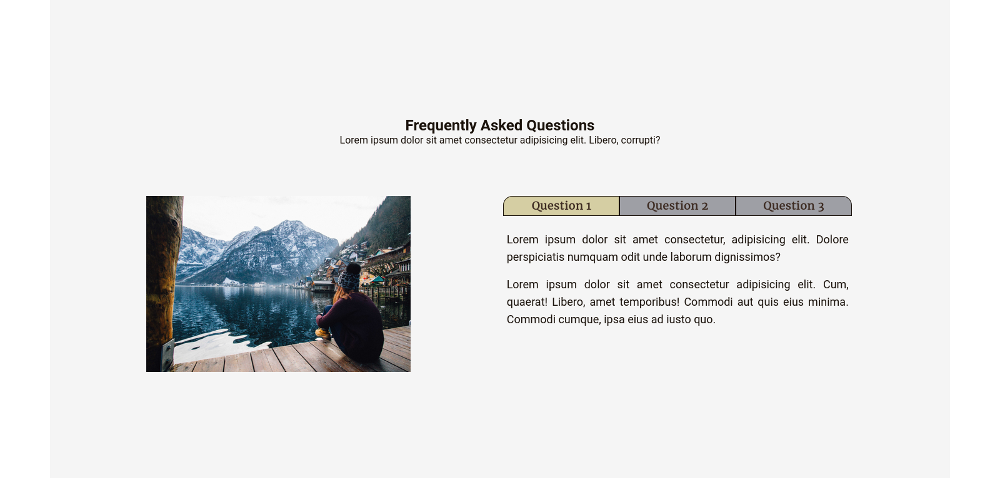

# Tabs Project

## Screenshot

## Features

- Mobile layout.
- Clickable tabs display differant FAQ questions and answers.

## Installation

1. Clone the repository: `https://github.com/AlexdelCarmen/tabs-project`
2. Open the `index.html` file in your web browser.

## Usage

Click the different tabs to change the displayed text.

## Technologies

Made with:

- HTML
- CSS
- JavaScript

## License

This project is released under the Unlicense. Please read the LICENSE file [License](./LICENSE).

## Credits

Inspired in John Smilga's video for freeCodeCamp `https://youtu.be/3PHXvlpOkf4`
